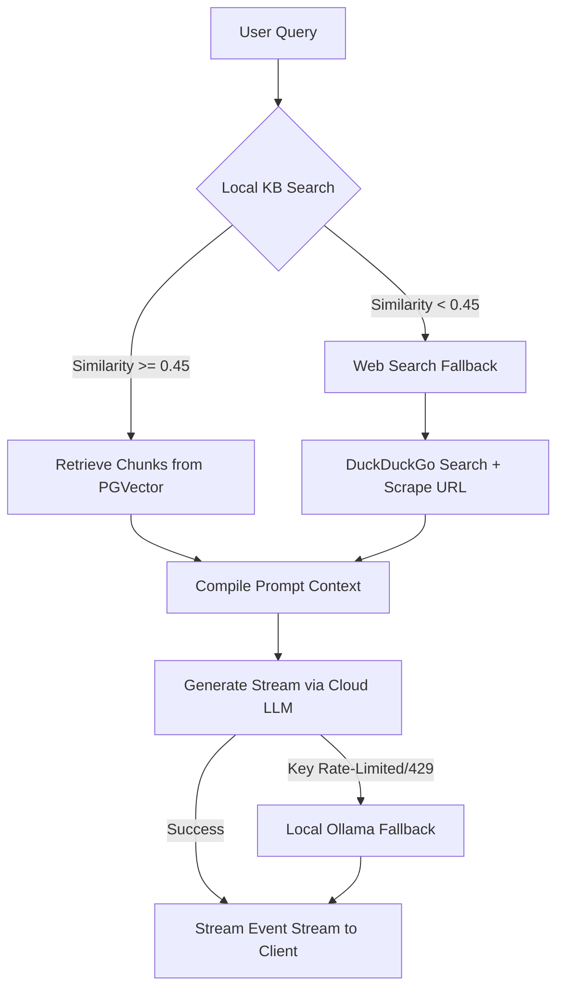

# Inquix Project Documentation

Welcome to the comprehensive documentation for **Inquix**, a notebook-style knowledge base (RAG) and search engine built with a Django (ASGI) backend and a Next.js (React) frontend.

---

## Table of Contents
1. [System Architecture Overview](#system-architecture-overview)
2. [Project Directory Structure](#project-directory-structure)
3. [Configuration & Environment Setup](#configuration--environment-setup)
4. [Backend Pipeline & Services](#backend-pipeline--services)
   - [Document Processing & Extraction](#document-processing--extraction)
   - [Embedding Service](#embedding-service)
   - [Vector Retrieval (RAG)](#vector-retrieval-rag)
   - [LLM Generation & Fallback](#llm-generation--fallback)
   - [Web Search & Crawling](#web-search--crawling)
   - [Text-to-Speech (TTS)](#text-to-speech-tts)
   - [Caching Layer](#caching-layer)
5. [Frontend Client](#frontend-client)
6. [Deployment & Execution](#deployment--execution)

---

## System Architecture Overview

Inquix operates on a hybrid architecture that integrates local services (via Docker and Ollama) with high-performance cloud providers. The workflow is designed for low latency, smooth real-time streaming, and fail-safe fallbacks.



---

## Project Directory Structure

Here is the directory outline of the codebase:

```bash
inquix/
├── docker-compose.yml         # Container configuration (postgres, redis, ollama, apps)
├── .env                       # Local environment configurations and API keys
├── backend/                   # Python Django project folder
│   ├── manage.py              # CLI utility for backend administration
│   └── app/                   # Core Django Application
│       ├── settings.py        # Django global settings
│       ├── urls.py            # Route mappings
│       ├── models.py          # Database models (KBs, Docs, Chunks, Messages)
│       ├── views.py           # API views and Server-Sent Events (SSE) logic
│       ├── config.py          # Pydantic configuration loader
│       └── services/          # Modular backend services
│           ├── cache.py       # Redis cache client wrapper
│           ├── chunking.py    # Document text segmentation logic
│           ├── embedding.py   # Embedding wrapper (Gemini, OpenAI, Jina, Ollama)
│           ├── extraction.py  # OCR, PDF/Doc/Audio ingestion pipelines
│           ├── generation.py  # LLM stream generators & providers
│           ├── retrieval.py   # pgvector database search wrapper
│           ├── tts.py         # Voice TTS generator (Kokoro, Edge-TTS)
│           └── web_search.py  # DuckDuckGo and Firecrawler search crawler
└── frontend/                  # Next.js React Application
    ├── components/            # UI Components (Chat, Sidebar, Suggestions)
    │   ├── ChatInterface.tsx  # Dynamic chat streaming pane
    │   └── ChatInput.tsx      # Multi-modal attachment chat input box
    └── app/                   # Page router configurations
```

---

## Configuration & Environment Setup

All application configurations are defined in [.env](file:///c:/Users/Tarek/Desktop/inquix/.env) and loaded dynamically into a Pydantic Settings schema inside [config.py](file:///c:/Users/Tarek/Desktop/inquix/backend/app/config.py).

> [!IMPORTANT]
> **API Key Validity & Gemini 3.5 Upgrade**:
> * Gemini 2.0 Flash (`gemini-2.0-flash`) is heavily restricted or daily-capped on free-tier AI Studio keys, frequently throwing `429 RESOURCE_EXHAUSTED` errors.
> * The system automatically routes Gemini API calls to **`gemini-3.5-flash`**, which has active free tier quota and provides faster responses.
> * If `DISABLE_OLLAMA=True`, local Ollama services (like `qwen2.5:3b` and `llava-phi3:3.8b`) are bypassed to save local CPU/GPU cycles, defaulting generation and visual tasks to cloud APIs.

---

## Backend Pipeline & Services

### Document Processing & Extraction
When a file is uploaded, [views.py](file:///c:/Users/Tarek/Desktop/inquix/backend/app/views.py) routes it to the `extract_text` pipeline inside [extraction.py](file:///c:/Users/Tarek/Desktop/inquix/backend/app/services/extraction.py):
* **Plain Text/Markdown/HTML**: Loaded directly.
* **PDF Ingestion**: Handled via `PyMuPDF` (`fitz`) in `extract_from_pdf` to preserve spatial text formatting.
* **DOCX Ingestion**: Decompressed natively and parsed paragraph-by-paragraph.
* **Audio Ingestion**: Transcribed offline via `faster-whisper` (`base` model on CPU).
* **Multi-Modal Images**:
  1. Runs `pytesseract` OCR to extract visible text.
  2. Submits the image to a cloud vision describer (`gemini-3.5-flash` $\rightarrow$ `gpt-4o-mini`) to obtain a visual summary.
  3. Combines both text fields for indexing.

### Embedding Service
Managed in [embedding.py](file:///c:/Users/Tarek/Desktop/inquix/backend/app/services/embedding.py):
* Resolves the primary embedding provider (Gemini, OpenAI, Jina, or Ollama).
* **Automatic Dimension Matching**: The database PostgreSQL schema uses a 3072-dimensional vector field ([models.py](file:///c:/Users/Tarek/Desktop/inquix/backend/app/models.py)). When local fallbacks (`nomic-embed-text` $\rightarrow$ 768 dimensions) are used, `get_embedding` dynamically pads the vector to exactly `3072` dimensions using zero-padding. This ensures no database insertion mismatches occur.

### Vector Retrieval (RAG)
Implemented in [retrieval.py](file:///c:/Users/Tarek/Desktop/inquix/backend/app/services/retrieval.py):
* Computes vector representations of user queries and uses pgvector's `CosineDistance` annotation to query the `Chunk` database model.
* Chunks are filtered against `similarity_threshold` (default `0.45` in [.env](file:///c:/Users/Tarek/Desktop/inquix/.env)).

### LLM Generation & Fallback
Implemented in [generation.py](file:///c:/Users/Tarek/Desktop/inquix/backend/app/services/generation.py):
* Generates a stable token generator for [views.py](file:///c:/Users/Tarek/Desktop/inquix/backend/app/views.py).
* Evaluates the query using a sequential fallback provider loop:
  1. **Groq**: Used for standard rapid text generation (`llama-3.3-70b-versatile`). Since Groq does not support vision payloads, if an image attachment is detected, the provider is auto-upgraded to Gemini.
  2. **Gemini**: Submits prompts to `gemini-3.5-flash` with direct multimodal capabilities.
  3. **OpenAI**: Falls back to `gpt-4o-mini` if Gemini fails.
  4. **Ollama**: Extreme local fallback (running `qwen2.5:3b` or `llava-phi3:3.8b` locally) if all cloud keys fail and Ollama is enabled.

### Web Search & Crawling
Defined in [web_search.py](file:///c:/Users/Tarek/Desktop/inquix/backend/app/services/web_search.py):
* If maximum RAG document similarity falls below `0.58`, the backend invokes web search fallback (bypassed if images are uploaded).
* Scrapes search results from DuckDuckGo, then triggers `Crawl4AI` (or `Firecrawl`) to fetch raw markdown data from the top 4 web pages in parallel.

### Text-to-Speech (TTS)
Defined in [tts.py](file:///c:/Users/Tarek/Desktop/inquix/backend/app/services/tts.py):
* Synthesizes audio tracks for model responses using local `Kokoro` or `Edge-TTS` engines, yielding standard `audio/wav` or `audio/mpeg` buffers.

### Caching Layer
Defined in [cache.py](file:///c:/Users/Tarek/Desktop/inquix/backend/app/services/cache.py):
* Wraps Redis connections to cache embeddings, scraped search queries, and LLM generated output streams.
* Uses **Smooth Playback Caching** (streaming cached prompts in 12-character blocks spaced by a 5ms delay) to simulate real-time generation when loading cache hits.

---

## Frontend Client

The frontend is a React application served by Next.js.
* **Chat Stream Processor**: Located in [ChatInterface.tsx](file:///c:/Users/Tarek/Desktop/inquix/frontend/components/ChatInterface.tsx). It establishes an HTTP POST streaming reader connection.
* **Immediate Token Display (10ms Pace)**: To guarantee real-time typing experiences and avoid blocks of text showing up all at once, the backend yields control back to the event loop via `asyncio.sleep(0.01)` after every token payload. The frontend updates state dynamically, rendering markdown increments instantly.
* **Conversation Transition Fix**: When a new conversation finishes streaming, `ChatInterface` compares `initialConvId === convId` to prevent the UI from clearing or displaying the `"Loading conversation..."` placeholder.

---

## Deployment & Execution

You can run the entire infrastructure locally using docker-compose commands.

### Ingestion & Startup
1. Make sure your [.env](file:///c:/Users/Tarek/Desktop/inquix/.env) file is updated with your cloud keys (`GROQ_API_KEY`, `GEMINI_API_KEY`, etc.).
2. Build and run containers:
   ```bash
   docker compose up --build -d
   ```
3. Verify running containers:
   ```bash
   docker compose ps
   ```
4. Access the frontend app at: [http://localhost:3000](http://localhost:3000)
5. Access the backend server at: [http://localhost:8000](http://localhost:8000)
